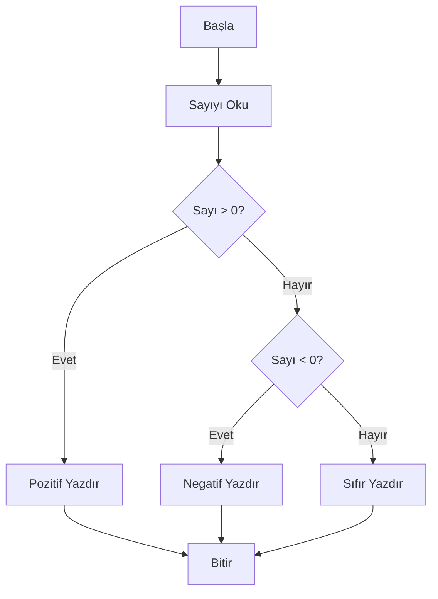

[Previous content remains the same until Algoritma Gösterim Şekilleri section]

### Algoritma Örnekleri

#### 1. Düz Metin Algoritma Örneği
İki sayının toplamını bulan algoritma:
1. Başla
2. İlk sayıyı al ve sayi1'e ata
3. İkinci sayıyı al ve sayi2'ye ata
4. toplam = sayi1 + sayi2 işlemini yap
5. toplam'ı ekrana yaz
6. Bitir

#### 2. Akış Şeması Örneği
Sayının pozitif, negatif veya sıfır olduğunu bulan akış şeması:



#### 3. Sözde Kod Örneği
En büyük sayıyı bulan algoritma:
```
BAŞLA
   SAYİ1, SAYİ2, SAYİ3'ü OKU
   EĞER (SAYİ1 > SAYİ2 VE SAYİ1 > SAYİ3) İSE
      YAZDIR "En büyük sayı: ", SAYİ1
   DEĞİLSE EĞER (SAYİ2 > SAYİ1 VE SAYİ2 > SAYİ3) İSE
      YAZDIR "En büyük sayı: ", SAYİ2
   DEĞİLSE
      YAZDIR "En büyük sayı: ", SAYİ3
   BİTİR EĞER
BİTİR
```

[Previous content remains the same until Fonksiyonlar/Metotlar section]

### Parametre Geçirme Örnekleri

#### Call by Value Örneği
```java
void swapByValue(int x, int y) {
    int temp = x;
    x = y;
    y = temp;
    // Değişiklikler metodun dışına yansımaz
}

int a = 5, b = 10;
swapByValue(a, b); // a ve b değerleri değişmez
```

#### Call by Reference Örneği
```java
class Number {
    int value;
}

void swapByReference(Number x, Number y) {
    int temp = x.value;
    x.value = y.value;
    y.value = temp;
    // Değişiklikler metodun dışına yansır
}

Number num1 = new Number(5);
Number num2 = new Number(10);
swapByReference(num1, num2); // Değerler değişir
```

#### Recursive Fonksiyon Örnekleri

1. Fibonacci Serisi:
```java
int fibonacci(int n) {
    if (n <= 1) return n;
    return fibonacci(n-1) + fibonacci(n-2);
}
```

2. Üs Alma:
```java
int power(int base, int exp) {
    if (exp == 0) return 1;
    return base * power(base, exp-1);
}
```

[Previous content remains the same until Diziler ve Koleksiyonlar section]

### Dizi Örneği
```java
// Dizideki elemanların toplamını bulan program
int[] sayilar = {1, 2, 3, 4, 5};
int toplam = 0;
for(int sayi : sayilar) {
    toplam += sayi;
}
System.out.println("Toplam: " + toplam);
```

### Koleksiyon Örnekleri

#### ArrayList Örneği
```java
ArrayList<String> isimler = new ArrayList<>();
isimler.add("Ali");    // Eleman ekleme
isimler.add("Veli");
isimler.add("Ayşe");
isimler.remove("Veli"); // Eleman silme
System.out.println(isimler.contains("Ali")); // True
```

#### Stack Örneği
```java
Stack<Integer> yigin = new Stack<>();
yigin.push(1);    // Eleman ekleme
yigin.push(2);
yigin.push(3);
System.out.println(yigin.pop());  // 3 çıkar
System.out.println(yigin.peek()); // 2 görünür ama çıkmaz
```

#### Queue Örneği
```java
Queue<String> kuyruk = new LinkedList<>();
kuyruk.offer("Birinci");    // Eleman ekleme
kuyruk.offer("İkinci");
kuyruk.offer("Üçüncü");
System.out.println(kuyruk.poll());  // "Birinci" çıkar
System.out.println(kuyruk.peek());  // "İkinci" görünür
```

[Previous content remains the same until Temel Algoritmalar section]

### Sıralama Algoritmaları Açıklamaları

#### Bubble Sort
- En basit sıralama algoritması
- Her geçişte yan yana elemanları karşılaştırır
- Zaman Karmaşıklığı: O(n²)

#### Selection Sort
- Dizideki en küçük elemanı bulup başa koyar
- Her adımda kalan elemanlardan en küçüğünü seçer
- Zaman Karmaşıklığı: O(n²)

### Arama Algoritmaları Açıklamaları

#### Linear Search
- Sırasız dizilerde kullanılır
- Her elemanı tek tek kontrol eder
- Zaman Karmaşıklığı: O(n)

#### Binary Search
- Sıralı dizilerde kullanılır
- Diziyi ortadan bölerek arama yapar
- Zaman Karmaşıklığı: O(log n)

[Previous content remains the same until Exception Tipleri section]

### Exception Örnekleri

#### ArithmeticException
```java
try {
    int sonuc = 10 / 0;  // Sıfıra bölme hatası
} catch(ArithmeticException e) {
    System.out.println("Sıfıra bölme hatası!");
}
```

#### ArrayIndexOutOfBoundsException
```java
try {
    int[] dizi = new int[3];
    dizi[3] = 10;  // Dizinin sınırları dışına erişim
} catch(ArrayIndexOutOfBoundsException e) {
    System.out.println("Dizi sınırları dışına çıkıldı!");
}
```

#### NullPointerException
```java
try {
    String str = null;
    System.out.println(str.length());  // Null nesneye erişim
} catch(NullPointerException e) {
    System.out.println("Null nesneye erişim hatası!");
}
```

#### FileNotFoundException
```java
try {
    FileReader file = new FileReader("olmayan_dosya.txt");
} catch(FileNotFoundException e) {
    System.out.println("Dosya bulunamadı!");
}
```

#### IOException
```java
try {
    BufferedReader reader = new BufferedReader(new FileReader("dosya.txt"));
    reader.readLine();
    reader.close();
} catch(IOException e) {
    System.out.println("Dosya okuma/yazma hatası!");
}
```

### Temel Veri Yapıları Örnekleri

#### Stack Örneği (Palindrom Kontrolü)
```java
boolean isPalindrome(String str) {
    Stack<Character> stack = new Stack<>();
    String temiz = str.toLowerCase().replaceAll("[^a-z]", "");
    
    // Karakterleri stack'e ekle
    for(char c : temiz.toCharArray()) {
        stack.push(c);
    }
    
    // Karakterleri karşılaştır
    for(char c : temiz.toCharArray()) {
        if(c != stack.pop()) return false;
    }
    return true;
}
```

#### Queue Örneği (Yazdırma Kuyruğu)
```java
class PrintQueue {
    Queue<String> documents = new LinkedList<>();
    
    void addDocument(String doc) {
        documents.offer(doc);
        System.out.println(doc + " kuyruğa eklendi");
    }
    
    void printNext() {
        String doc = documents.poll();
        if(doc != null) {
            System.out.println(doc + " yazdırılıyor...");
        }
    }
}
```

#### Linked List Örneği
```java
class Node {
    int data;
    Node next;
    
    Node(int data) {
        this.data = data;
        this.next = null;
    }
}

class LinkedList {
    Node head;
    
    void add(int data) {
        Node newNode = new Node(data);
        if(head == null) {
            head = newNode;
            return;
        }
        
        Node current = head;
        while(current.next != null) {
            current = current.next;
        }
        current.next = newNode;
    }
    
    void display() {
        Node current = head;
        while(current != null) {
            System.out.print(current.data + " -> ");
            current = current.next;
        }
        System.out.println("null");
    }
}
```

[Rest of the content remains the same]
